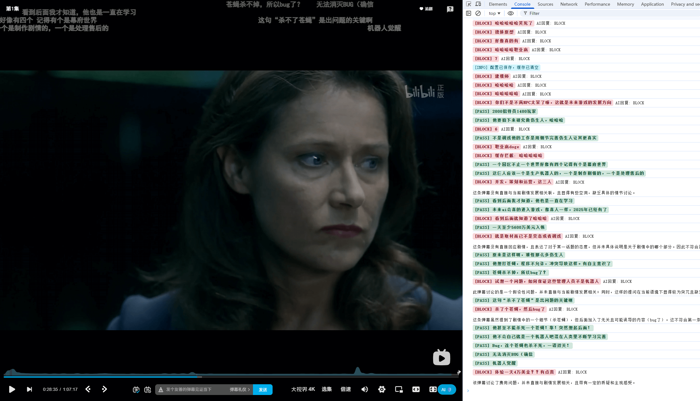
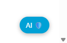
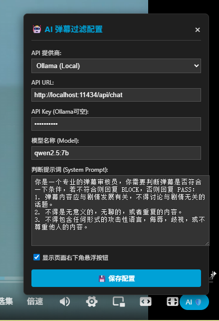

# Bilibili AI 弹幕过滤器

> 脚本代码地址: <https://github.com/Yesaye/tampermonkey-script/blob/main/bilibili-dm-ai-auditor.js>

根据AI大模型的判断结果，隐藏不想看到的弹幕。

## 使用说明

1. 在右下角找到“AI”选项，或油猴插件中打开“AI弹幕设置”
2. 配置好大模型
3. （可选）修改判断提示词，但请注意不要改变AI回复结果中的“Block”和“Pass”
4. 点击保存，即生效（F12控制台会显示判断结果的日志）

## 注意事项

1. 本插件也是使用AI生成
2. 临时想到，写一个玩玩，效果还可以，遂发布一下
3. 建议使用本地跑的小参数模型，如图中所示，响应快还免费

## 附件

