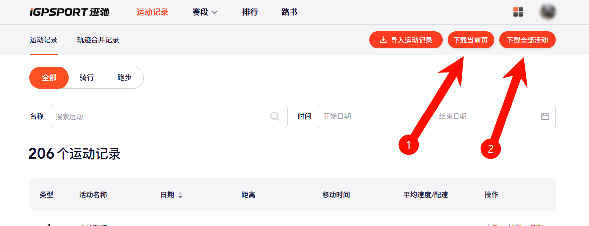
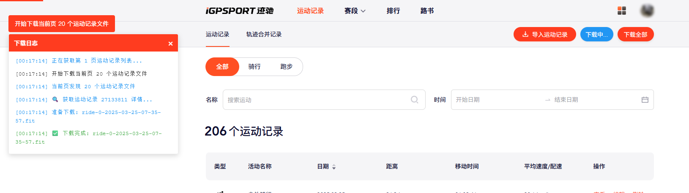

# iGPSPORT运动记录下载助手

## 使用方法

1. 打开 iGPSPORT 的运动记录页面，网址为: https://app.zh.igpsport.com/sport/history/list
2. 可以看到在“导入运动记录”按钮的右边增加了两个按钮，分别为：“下载当前页”和“下载全部”两个按钮。
3. 点击“下载当前页”按钮，会下载当前页的所有运动记录。
4. 点击“下载全部”按钮，会下载所有运动记录，由于数据量较大，可能需要一些时间，请耐心等待。

