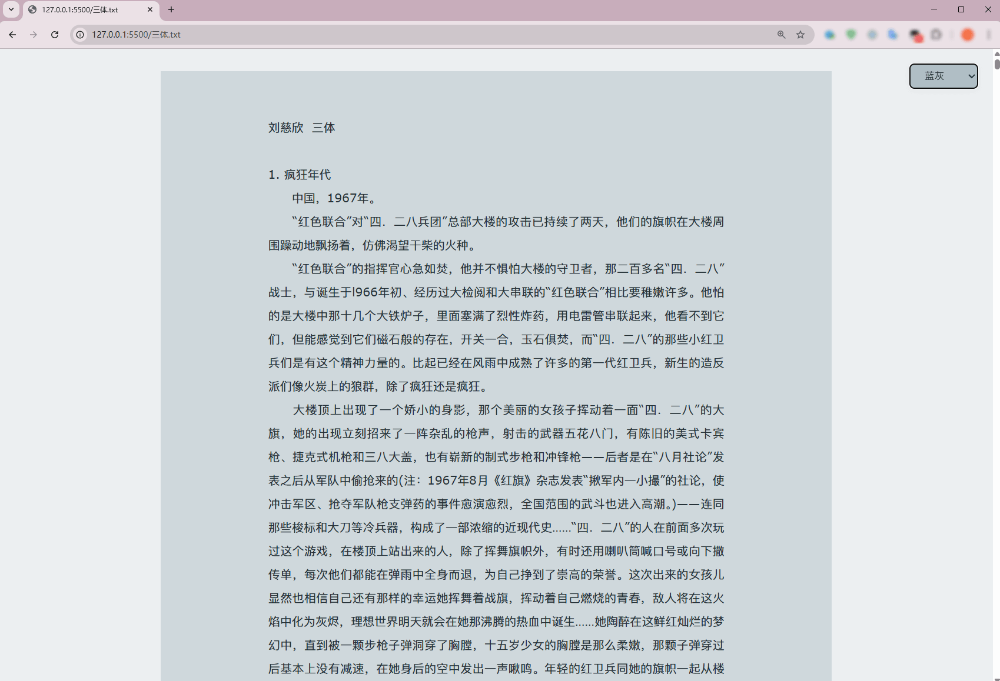
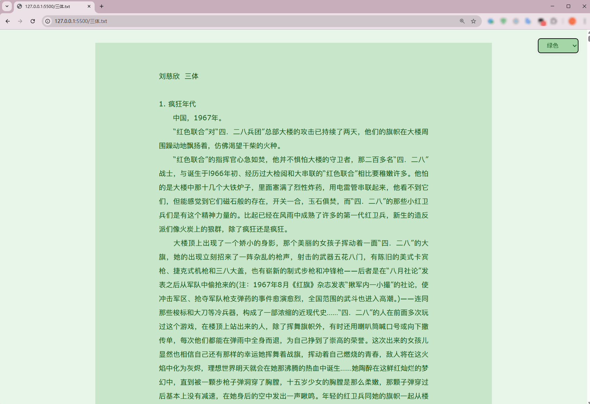

# txt阅读器（仿pixiv，多主题）

> 脚本代码地址: [https://github.com/Yesaye/tampermonkey-script](https://github.com/Yesaye/tampermonkey-script)

访问txt时，美化阅读样式，有多个主题可供切换

## 部分不生效解决办法

1. 阅读本地的txt时不生效

    1. 右键油猴脚本插件图标，点击选项“管理扩展程序”
    2. 勾选“允许访问文件网址”即可

2. 直接访问txt网址时不生效

    1. ctrl+s保存txt文件
    2. 在浏览器打开txt文件
    3. 然后按上面第一种情况操作，勾选油猴脚本的“允许访问文件网址”即可

## 主题展示

- 
- 
- 
- 
- 
- 
- 
- 
- 
- 
